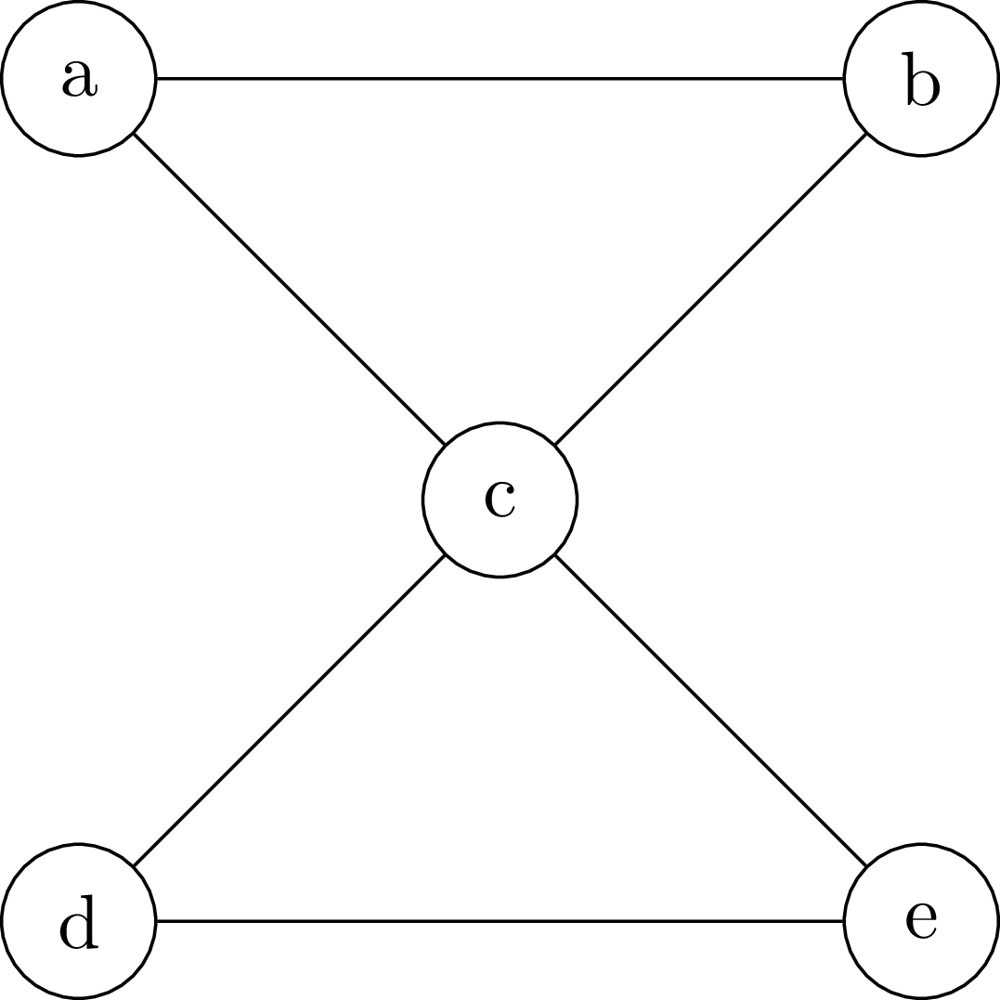
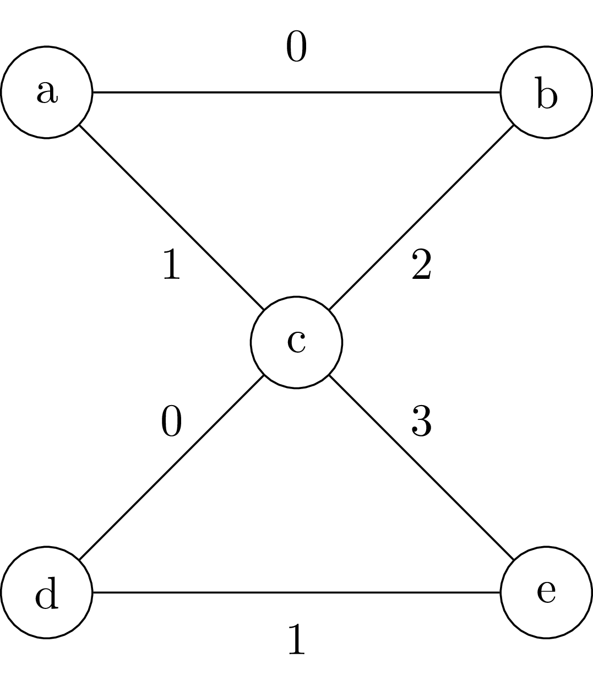
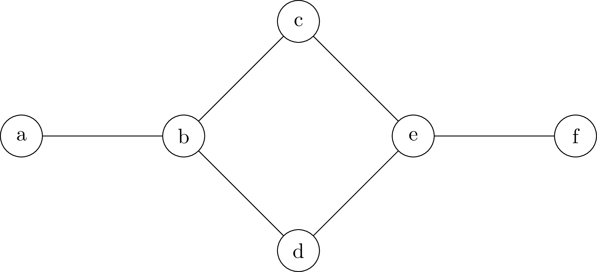
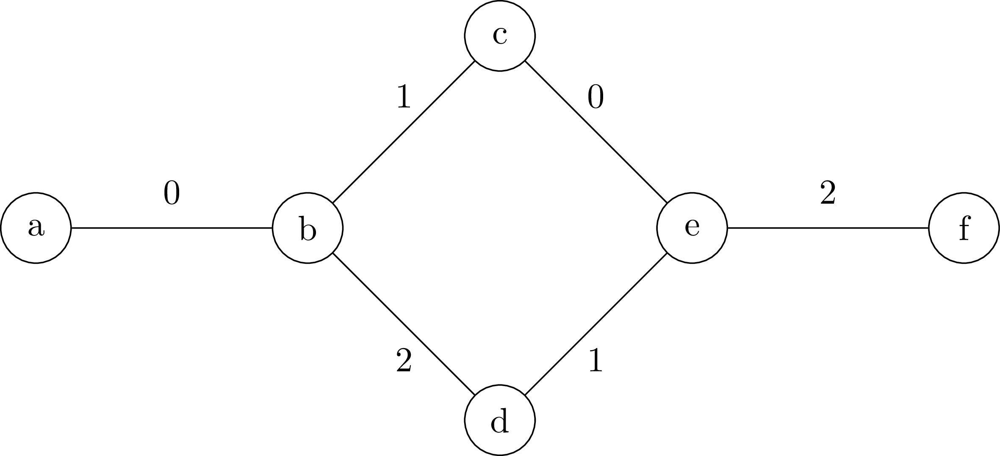

# Προγραμματισμός Τουρνουά

Σε ένα τουρνουά κάποιου αθλήματος θα συναγωνιστούν οι ενδιαφερόμενοι
παίζοντας μεταξύ τους σε ζεύγη. Τα ζεύγη αυτά δηλώνονται με τη σειρά.
Ο διοργανωτής (εσείς) πρέπει να προγραμματίσει το τουρνουά, ώστε κάθε
ένας συναγωνιζόμενος να έχει έναν μόνο αγώνα κάθε ημέρα.

Για παράδειγμα, έστω ότι έχουμε τα ακόλουθα ζευγάρια αγώνων:
```
a b
a c
b c
c d
d e
e c
```
Θα πρέπει να προγραμματίσετε τους αγώνες ώστε ο `a` να παίζει με τον
`b` διαφορετική ημέρα από την ημέρα που θα παίξει με τον `c`, κ.λπ.

Βεβαίως ένας προφανής τρόπος είναι να προγραμματίσετε έναν αγώνα την
ημέρα, αλλά αυτό δεν είναι πρακτικό, γιατί εύκολα ένα τουρνουά θα
καταλήξει να διαρκεί πάρα πολύ καιρό.

Γι' αυτό λοιπόν θα εργαστείτε ως εξής. Θεωρούμε ότι οι ημέρες του
τουρνουά αριθμούνται από το 0, 1, 2, ....

* Παίρνετε ένα-ένα ζευγάρι με τη σειρά.
* Σε κάθε ζευγάρι που παίρνετε, έστω `x` και `y`, αντιστοιχείτε την
  μικρότερη ημέρα που μπορείτε έτσι ώστε ούτε ο `x` ούτε ο `y` να μην
  έχουν αγώνα την ίδια ημέρα.

Ας δούμε πως δουλεύει ο αλγόριθμος αυτός στο παράδειγμά μας. Στην
πραγματικότητα, το παράδειγμά μας μπορούμε να το δούμε ως ένα γράφο.
Οι κορυφές του γράφου είναι οι συμμετέχοντες και οι ακμές είναι οι
μεταξύ τους αγώνες. Οπότε προκύπτει ο παρακάτω γράφος:



Αν εργαστούμε όπως περιγράψαμε, τότε θα προκύψει ο ακόλουθος
προγραμματισμός, όπου σε κάθε ακμή του γράφου έχουμε σημειώσει την
ημέρα που θα διεξαχθεί ο αγώνας.



συνεπώς την ημέρα 0 θα γίνουν οι αγώνες `(a, b)`, `(c, d)`,την
ημέρα 1 οι αγώνες `(a, c)`, `(d, e)`, την ημέρα 2 ο αγώνας
`(b, c)`, και την ημέρα 3 ο αγώνας `(c, e)`.

Αν οι αγώνες μας ήταν:
```
a b
b c
b d
c e
d e
e f
```
τότε θα είχαμε το γράφο:



από τον οποίο θα καταλήγαμε στο τουρνουά:



Σκοπός της εργασίας είναι ακριβώς η κατασκευή προγράμματος που θα
προγραμματίζει τη διεξαγωγή ενός τουρνουά όπως περιγράψαμε.

## Απαιτήσεις Προγράμματος

Κάθε φοιτητής θα εργαστεί στο προσωπικό του αποθετήριο στο GitHub. Για
να αξιολογηθεί μια εργασία θα πρέπει να πληροί τις παρακάτω
προϋποθέσεις:

1. Όλη η εργασία θα πρέπει να βρίσκεται σε έναν κατάλογο
   `assignment-2017-1` μέσα στο αποθετήριο του φοιτητή.
2. Το πρόγραμμα θα πρέπει να έχει όνομα `plan_matches.py`.
3. Εννοείται ότι δεν επιτρέπεται η χρήση έτοιμων βιβλιοθηκών γράφων ή
   τυχόν έτοιμων υλοποιήσεων των αλγορίθμων, ή τμημάτων αυτών.
4. Το πρόγραμμα θα μπορεί να καλείται ως εξής:
```
python plan_matches.py graph_file
```

Η παράμετρος `graph_file` δίνει το όνομα του αρχείου στο οποίο είναι
αποθηκευμένα ο γράφος (αυτό δεν σημαίνει ότι το αρχείο ονομάζεται ντε
και καλά `graph_file`, ο χρήστης μπορεί να δίνει οποιοδήποτε όνομα).
Το αρχείο θα περιέχει ένα σύνδεσμο, δηλαδή παιχνίδι, ανά γραμμή. Οι
συμπαίκτες δεν είναι απαραίτητο ότι αναπαρίστανται από ένα γράμμα ο
καθένας· απλώς χρησιμοποιήσαμε τέτοια ονόματα στα μέχρι τώρα
παραδείγματα για να ζωγραφίζονται εύκολα. Οι συμπαίκτες μπορεί να
αναπαρίστανται με κανονικά ονόματα, ή συνδυασμούς γραμμάτων και
αριθμών. 

### Περιγραφή Εξόδου

*Προσοχή:* αν η έξοδος δεν είναι ακριβώς σύμφωνη με την περιγραφή της,
η εργασία *δεν θα μπορεί να αξιολογηθεί*.

Το πρόγραμμα θα πρέπει να εμφανίζει στην έξοδο τον προγραμματισμό των
αγώνων ως γραμμές, *ταξινομημένες αλφαβητικά*, με την παρακάτω μορφή.
```
(p, q) x
```
όπου `p` και `q` είναι δύο συναγωνιζόμενοι και `x` είναι η μέρα
στην οποία θα γίνει ο μεταξύ τους αγώνας. Έτσι, στο πρώτο
παράδειγμά μας, η έξοδος θα είναι:
```
(a, b) 0
(a, c) 1
(b, c) 2
(c, d) 0
(c, e) 3
(d, e) 1
```

Αντίστοιχα, στο δεύτερο παράδειγμά μας, η έξοδος θα είναι:
```
(a, b) 0
(b, c) 1
(b, d) 2
(c, e) 0
(d, e) 1
(e, f) 2
```

### Παραδείγματα

* Το αρχείο που αντιστοιχεί στο παραπάνω παράδειγμα είναι το
  [example_graph_1.txt](example_graph_1.txt).

* Το αρχείο που αντιστοιχεί στο παραπάνω παράδειγμα είναι το
  [example_graph_2.txt](example_graph_2.txt).

* Αν χρησιμοποιήσουμε το αρχείο
  [example_graph_3.txt](example_graph_3.txt), τότε ως λύση θα πάρουμε
  τα περιεχόμενα του αρχείου
  [example_graph_3_solved.txt](example_graph_3_solved.txt). 

* Αν χρησιμοποιήσουμε το αρχείο
  [example_graph_4.txt](example_graph_4.txt), τότε ως λύση θα πάρουμε
  τα περιεχόμενα του αρχείου
  [example_graph_4_solved.txt](example_graph_4_solved.txt). 


Καλή Επιτυχία.

# Περισσότερες Πληροφορίες

Το πρόβλημα που περιγράψαμε ονομάζεται *πρόβλημα χρωματισμού ακμών*
(edge colouring problem).

* Το σχετικό άρθρο της
[Wikipedia](https://en.wikipedia.org/wiki/Edge_coloring) έχει αρκετά
στοιχεία. 

* Αποδεικνύεται ότι, αν ο μέγιστος βαθμός που έχει ένας κόμβος του
  γράφου είναι `d`, τότε ο χρωματισμός μπορεί να γίνει με το πολύ
  `d` ή `d + 1` χρώματα.

* Το πρόβλημα του αν μπορεί να γίνει με `d` ή με `d+1` χρώματα και η
  εύρεση της βέλτιστης λύσης είναι πολύ δύσκολο να λυθεί (οι
  γρηγορότεροι αλγόριθμοι έχουν εκθετική πολυπλοκότητα).

* Εμείς δεν περιγράψαμε τη βέλτιστη λύση. Ο αλγόριθμος που δώσαμε
  δίνει μια λύση που μπορεί να χρειάζεται το πολύ διπλάσια χρώματα από
  όσο η βέλτιστη.

* Ο αλγόριθμος όμως έχει ένα βασικό πλεονέκτημα: μπορεί να
  λειτουργήσει ακόμα και αν ο γράφος μας δίνεται τμηματικά, δηλαδή αν
  οι παίκτες δηλώνουν συμμετοχή σταδιακά στο τουρνουά. Είναι δηλαδή
  ένας *on-line* αλγόριθμος, αφού δεν χρειάζεται να περιμένει το
  σύνολο της εισόδου για να αρχίσει να παράγει τη λύση. Μάλιστα
  αποδεικνύεται ότι είναι ο ταχύτερος on-line αλγόριθμος για το
  συγκεκριμένο πρόβλημα.
